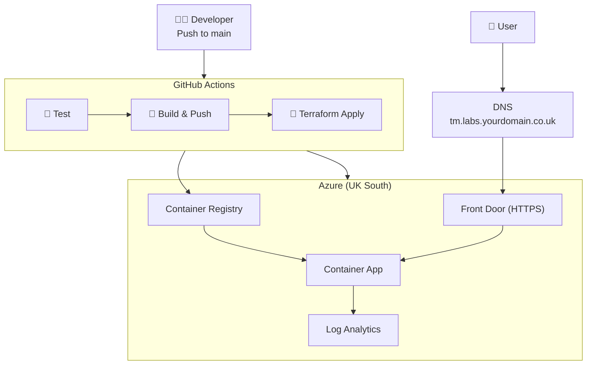
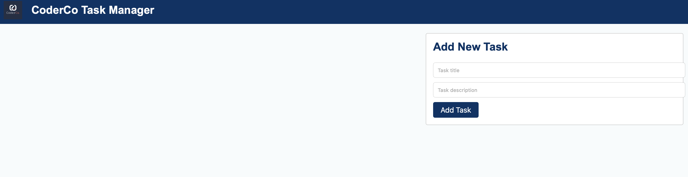
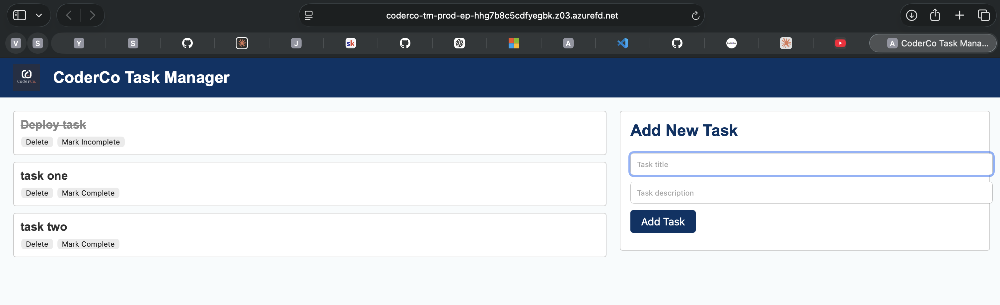

<div align="center">
  
</div>

# CoderCo Task Manager — Azure Deployment

A Flask task manager app containerised with Docker and deployed on Azure using Terraform and GitHub Actions CI/CD.

Live at: **https://tm.labs.\<yourdomain\>.co.uk**

---

## Architecture



See [docs/architecture.md](docs/architecture.md) for full component breakdown.

---

## Stack

| Component | Technology |
|---|---|
| App | Python / Flask |
| Container image | Docker → Azure Container Registry |
| Compute | Azure Container Apps |
| HTTPS / CDN | Azure Front Door (Standard) |
| Networking | Azure VNet + dedicated subnet |
| Observability | Log Analytics Workspace |
| IaC | Terraform (azurerm ~> 3.110) |
| CI/CD | GitHub Actions |

---

## CI/CD Pipeline

Every push to `main` runs three jobs in sequence:

1. **Test** — installs dependencies, runs `pytest` against `app/tests/`
2. **Build & Push** — logs into ACR via OIDC, builds the Docker image tagged with the short commit SHA, pushes both `:<sha>` and `:latest`
3. **Terraform Apply** — runs `terraform apply` passing the new image tag so the Container App rolls to the new revision automatically

Required GitHub Secrets:

| Secret | Description |
|---|---|
| `AZURE_CLIENT_ID` | Service principal client ID (OIDC) |
| `AZURE_TENANT_ID` | Azure AD tenant ID |
| `AZURE_SUBSCRIPTION_ID` | Azure subscription ID |
| `ACR_NAME` | ACR registry name, e.g. `codercotmprodacr` |

---

## Infrastructure

```
terraform/
  environments/prod/   # root module — resource group, wires modules together
  modules/
    networking/        # VNet + Container Apps subnet (/23)
    acr/               # Azure Container Registry (Basic, managed identity)
    container-app/     # Log Analytics, CAE, identity, role assignment, Container App
    frontdoor/         # Front Door profile, endpoint, origin, route, custom domain
```

### First-time deploy

```bash
cd terraform/environments/prod
terraform init
terraform plan
terraform apply
```

### Bootstrap Docker image

```bash
ACR_NAME="codercotmprodacr"
az acr login --name $ACR_NAME
docker build -t ${ACR_NAME}.azurecr.io/task-manager:latest app/
docker push ${ACR_NAME}.azurecr.io/task-manager:latest
```

---

## Running Locally

```bash
cd app
python3 -m venv .venv && source .venv/bin/activate
pip install -r requirements.txt
python3 app.py
```

App runs at http://localhost:3000

```bash
# Create a task
curl -X POST http://localhost:3000/tasks \
  -H "Content-Type: application/json" \
  -d '{"title":"My first task"}'

# List tasks
curl http://localhost:3000/tasks
```

---

## Screenshots

### Home Page


### Task Manager in Action

