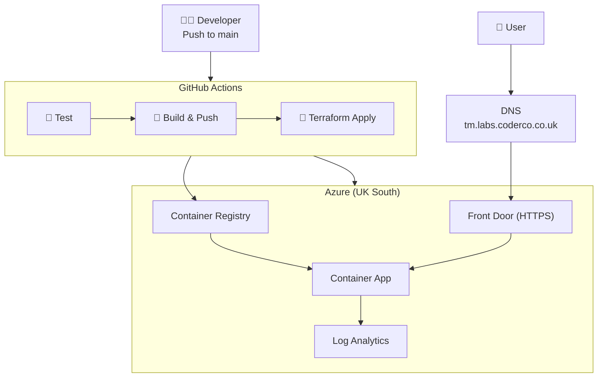

# Architecture

## Diagram

## Components

| Component | Purpose |
|---|---|
| ACR | Stores Docker images |
| Container App | Runs the Flask app |
| Front Door | HTTPS, CDN, global routing |
| Log Analytics | Logs and metrics |
